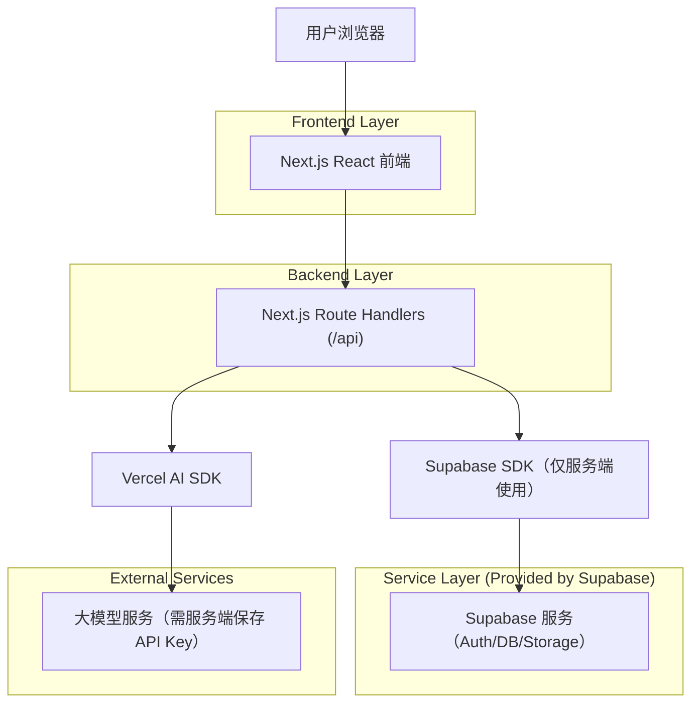
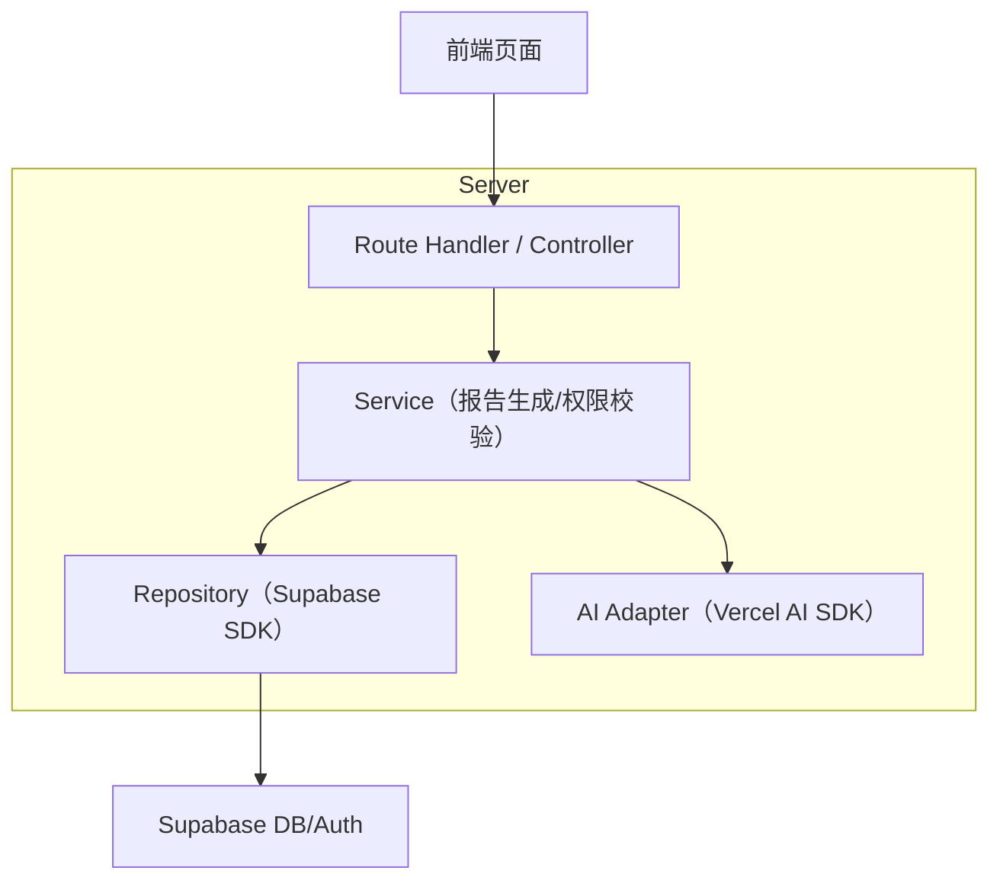
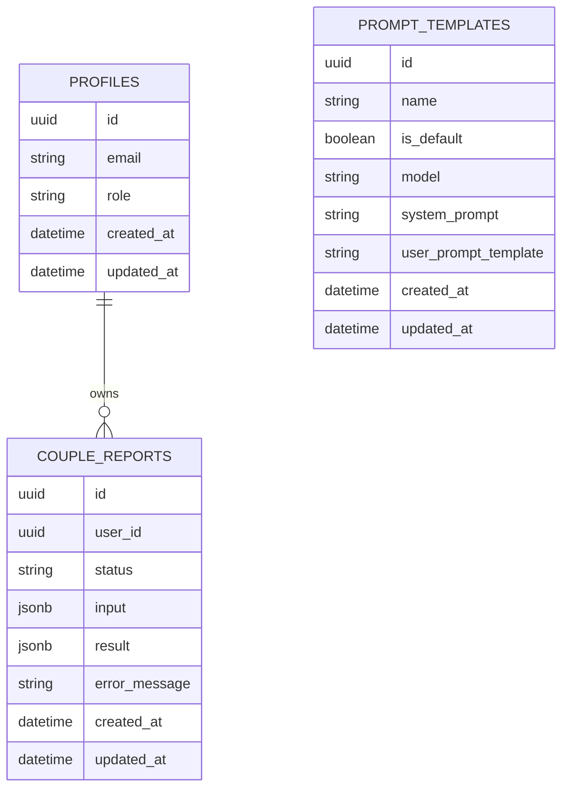

## 1.Architecture design



## 2.Technology Description

* Frontend: Next.js（React\@18）+ TypeScript + Tailwind CSS

* Backend: Next.js Route Handlers（同仓全栈）+ Vercel AI SDK

* Database/Auth: Supabase（PostgreSQL + Auth）

## 3.Route definitions

| Route         | Purpose                  |
| ------------- | ------------------------ |
| /             | 首页：信息录入、生成入口、我的报告列表      |
| /login        | 邮箱验证码登录与退出               |
| /report/\[id] | 报告详情：分析/建议/行动计划与状态       |
| /admin        | 后台首页：模板管理、报告管理、基础配置（管理员） |

## 4.API definitions (If it includes backend services)

### 4.1 Core Types (shared)

```ts
export type UserRole = 'user' | 'admin';

export type CoupleInput = {
  personA: { name?: string; birthDate: string; birthTime?: string; birthPlace?: string; gender?: 'male' | 'female' | 'other' };
  personB: { name?: string; birthDate: string; birthTime?: string; birthPlace?: string; gender?: 'male' | 'female' | 'other' };
};

export type ReportStatus = 'queued' | 'generating' | 'succeeded' | 'failed';

export type CoupleReport = {
  id: string;
  userId: string;
  input: CoupleInput;
  status: ReportStatus;
  result?: { baziAnalysis: string; gettingAlongTips: string; actionPlan: string };
  errorMessage?: string;
  createdAt: string;
  updatedAt: string;
};
```

### 4.2 Auth

* `POST /api/auth/request-otp`：发送邮箱验证码

* `POST /api/auth/verify-otp`：校验验证码并建立会话（httpOnly Cookie）

* `POST /api/auth/logout`：退出登录

### 4.3 Reports

* `POST /api/report/create`：创建报告记录（status=queued）并触发生成

* `GET /api/report/:id`：获取报告详情（仅本人或管理员）

* `GET /api/report/list`：获取我的报告列表

* `POST /api/report/:id/retry`：失败后重试生成

### 4.4 Admin

* `GET /api/admin/templates` / `POST /api/admin/templates` / `PUT /api/admin/templates/:id`：模板管理

* `GET /api/admin/reports`：全量报告列表与筛选

* `PUT /api/admin/settings`：基础配置（默认模板、限流参数等）

### 4.5 AI Generation

* `POST /api/ai/generate-report`：使用 Vercel AI SDK 生成三段结构化内容，并回写 Supabase

## 5.Server architecture diagram (If it includes backend services)



## 6.Data model(if applicable)

### 6.1 Data model definition



### 6.2 Data Definition Language

> 说明：为降低早期迭代成本，表间关联使用逻辑外键（不创建物理 FK 约束）。

```sql
-- profiles
CREATE TABLE IF NOT EXISTS profiles (
  id UUID PRIMARY KEY,
  email TEXT NOT NULL,
  role TEXT NOT NULL DEFAULT 'user' CHECK (role IN ('user','admin')),
  created_at TIMESTAMPTZ NOT NULL DEFAULT NOW(),
  updated_at TIMESTAMPTZ NOT NULL DEFAULT NOW()
);

-- couple_reports
CREATE TABLE IF NOT EXISTS couple_reports (
  id UUID PRIMARY KEY DEFAULT gen_random_uuid(),
  user_id UUID NOT NULL,
  status TEXT NOT NULL CHECK (status IN ('queued','generating','succeeded','failed')),
  input JSONB NOT NULL,
  result JSONB,
  error_message TEXT,
  created_at TIMESTAMPTZ NOT NULL DEFAULT NOW(),
  updated_at TIMESTAMPTZ NOT NULL DEFAULT NOW()
);
CREATE INDEX IF NOT EXISTS idx_couple_reports_user_id_created_at ON couple_reports (user_id, created_at DESC);

-- prompt_templates
CREATE TABLE IF NOT EXISTS prompt_templates (
  id UUID PRIMARY KEY DEFAULT gen_random_uuid(),
  name TEXT NOT NULL,
  is_default BOOLEAN NOT NULL DEFAULT FALSE,
  model TEXT NOT NULL,
  system_prompt TEXT NOT NULL,
  user_prompt_template TEXT NOT NULL,
  created_at TIMESTAMPTZ NOT NULL DEFAULT NOW(),
  updated_at TIMESTAMPTZ NOT NULL DEFAULT NOW()
);
CREATE INDEX IF NOT EXISTS idx_prompt_templates_is_default ON prompt_templates (is_default);

-- RLS (建议开启)
ALTER TABLE profiles ENABLE ROW LEVEL SECURITY;
ALTER TABLE couple_reports ENABLE ROW LEVEL SECURITY;
ALTER TABLE prompt_templates ENABLE ROW LEVEL SECURITY;

-- profiles：用户仅可读写自己的 profile；管理员可读写全部
CREATE POLICY "profiles_self" ON profiles
  FOR ALL TO authenticated
  USING (id = auth.uid())
  WITH CHECK (id = auth.uid());

CREATE POLICY "profiles_admin_all" ON profiles
  FOR ALL TO authenticated
  USING (EXISTS (SELECT 1 FROM profiles p WHERE p.id = auth.uid() AND p.role = 'admin'))
  WITH CHECK (EXISTS (SELECT 1 FROM profiles p WHERE p.id = auth.uid() AND p.role = 'admin'));

-- reports：用户仅访问自己的报告；管理员可访问全部
CREATE POLICY "reports_self" ON couple_reports
  FOR ALL TO authenticated
  USING (user_id = auth.uid())
  WITH CHECK (user_id = auth.uid());

CREATE POLICY "reports_admin_all" ON couple_reports
  FOR ALL TO authenticated
  USING (EXISTS (SELECT 1 FROM profiles p WHERE p.id = auth.uid() AND p.role = 'admin'))
  WITH CHECK (EXISTS (SELECT 1 FROM profiles p WHERE p.id = auth.uid() AND p.role = 'admin'));

-- templates：仅管理员可管理；普通用户只读默认模板（如需要前端展示“说明”）
CREATE POLICY "templates_admin_manage" ON prompt_templates
  FOR ALL TO authenticated
  USING (EXISTS (SELECT 1 FROM profiles p WHERE p.id = auth.uid() AND p.role = 'admin'))
  WITH CHECK (EXISTS (SELECT 1 FROM profiles p WHERE p.id = auth.uid() AND p.role = 'admin'));

CREATE POLICY "templates_read_default" ON prompt_templates
  FOR SELECT TO authenticated
  USING (is_default = TRUE);

-- 最小授权（示例）
GRANT SELECT ON prompt_templates TO authenticated;
GRANT ALL PRIVILEGES ON profiles TO authenticated;
GRANT ALL PRIVILEGES ON couple_reports TO authenticated;
```

**关键实现要点**

* LLM API Key 仅存放在服务端环境变量（供 Vercel AI SDK 使用），前端不接触密钥。

* 生成内容建议强制结构化输出（三段字段），以便稳定渲染与重试。

* 管理员判定：`profiles.role='admin'`；登录成功后首次可自动

