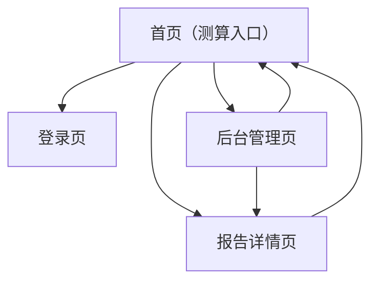

## 1. Product Overview

“两人八字适配”网站用于让你输入双方出生信息，生成八字匹配分析、相处建议与可执行行动计划，并支持保存与回看报告。
面向普通用户自助测算与管理员运营（模板与内容审核），以低门槛邮箱登录为核心入口。

## 2. Core Features

### 2.1 User Roles

| 角色     | 注册/登录方式                                                | 核心权限                                                               |
| -------- | ------------------------------------------------------------ | ---------------------------------------------------------------------- |
| 访客     | 无需登录                                                     | 可浏览首页说明；可填写信息但无法保存报告（仅生成预览或提示登录后保存） |
| 登录用户 | 邮箱验证码登录（Supabase Auth）                              | 生成完整报告；保存/查看历史报告；查看单份报告详情                      |
| 管理员   | 由管理员账号登录（同样使用邮箱验证码），在后台被标记为 admin | 管理提示词模板；查看所有报告与生成状态；配置默认模型与安全限制         |

### 2.2 Feature Module

本产品需求由以下主要页面构成：

1. **首页（测算入口）**：产品介绍、双方出生信息表单、生成按钮、报告列表入口。
2. **登录页**：邮箱验证码登录、登录态提示与退出。
3. **报告详情页**：展示八字分析/相处建议/行动计划、生成状态与重试。
4. **后台管理页**：提示词模板管理、报告管理与基础配置。

### 2.3 Page Details

| Page Name        | Module Name              | Feature description                                                                                             |
| ---------------- | ------------------------ | --------------------------------------------------------------------------------------------------------------- |
| 首页（测算入口） | 顶部导航                 | 显示 Logo、登录/退出、进入后台（仅管理员可见）。                                                                |
| 首页（测算入口） | 信息录入表单             | 录入双方：姓名/称呼（可选）、性别（可选）、出生日期、出生时间（可选）、出生地（可选）；提供字段校验与必填提示。 |
| 首页（测算入口） | 生成与保存               | 点击生成：对未登录用户提示先登录；对已登录用户创建报告并进入“生成中”状态。                                      |
| 首页（测算入口） | 我的报告列表             | 列出最近报告（标题、创建时间、状态）；点击跳转报告详情。                                                        |
| 登录页           | 邮箱验证码登录           | 输入邮箱→发送验证码→输入验证码→登录；展示发送与校验错误信息。                                                   |
| 登录页           | 登录态管理               | 显示当前登录邮箱；支持退出登录。                                                                                |
| 报告详情页       | 报告状态与内容展示       | 按模块展示：八字适配分析、相处建议、行动计划；展示“生成中/成功/失败”与失败原因（可重试）。                      |
| 报告详情页       | 可读性与导出（最小可用） | 提供复制全文按钮；提供分享提示（仅复制链接，访问需登录且属于本人）。                                            |
| 后台管理页       | 提示词模板管理           | 新增/编辑/启用模板：系统提示词、用户提示词模板、模型名、输出结构约束；设置默认模板。                            |
| 后台管理页       | 报告管理                 | 查看报告列表（筛选状态/时间）；查看单份报告的输入与输出；对失败报告触发重试生成。                               |
| 后台管理页       | 基础配置                 | 配置安全策略（最大生成字数/频率限制提示）；查看当前模型与版本说明。                                             |

## 3. Core Process

**登录用户流程**：你在首页填写双方出生信息 → 点击生成 → 系统创建报告并进入生成中 → 生成完成后进入报告详情页查看三段内容（分析/建议/行动计划）→ 报告自动保存，可在首页“我的报告”回看。

**访客流程**：你在首页填写信息 → 点击生成 → 系统提示你先用邮箱验证码登录 → 登录成功后回到首页继续生成并保存。

**管理员流程**：你登录后进入后台 → 维护默认提示词模板与模型配置 → 查看报告生成状态与失败原因 → 必要时重试生成。

## 4. 用户使用说明

1. 进入首页，在“双方出生信息”中填写至少：双方出生日期（建议补充出生时间与出生地以提高准确性）。
2. 点击“生成报告”。若未登录，按提示用邮箱验证码完成登录后再生成。
3. 生成完成后，在“报告详情”阅读三部分内容：
   - 八字分析：核心匹配点、优势与风险点。

   - 相处建议：沟通方式、冲突处理、边界与期待。

   - 行动计划：按 7 天/30 天给出可执行任务与复盘点。

4. 回到首页“我的报告”可查看历史记录；点击任一条进入详情。
5. 若看到“生成失败”，在报告详情页点击“重试生成”。
